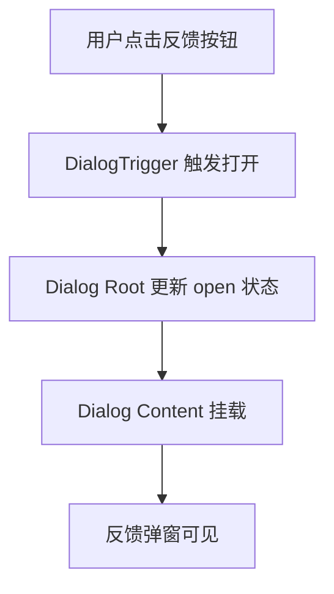

# Feedback Dialog Regression Fix

## 摘要

- **功能目标**：修复反馈按钮点击后无明显反馈的回归风险，确保反馈弹窗可以稳定打开。
- **核心决策**：保留现有反馈入口交互，修复 `Dialog` 包装组件的 `ref` 传递问题，并增加页面级回归测试。
- **当前状态**：文档已批准，可以进入实现和测试阶段。

---

## 术语定义

> <!-- TODO: 词汇表待建，暂不引用 -->

| 术语            | 定义                                                       |
| --------------- | ---------------------------------------------------------- |
| Feedback Dialog | 顶部“反馈 / Feedback”按钮触发的反馈弹窗。                  |
| Regression      | 已经上线或已实现的功能在后续改动中出现不可用或不稳定行为。 |

## 1. 需求背景

- **议题编号**: `feedback-dialog-regression`
- **业务背景**: Web 端已经接入反馈表单，用户需要能够通过顶部入口直接提交问题和建议。
- **当前问题**:
  1. 用户反馈“反馈”按钮点击后没有反应。
  2. 本地检查发现 `Dialog` 包装组件在打开反馈弹窗时输出 `Function components cannot be given refs` 警告，说明当前封装存在不稳定点。
- **目标**:
  1. 确保点击反馈按钮后弹窗稳定打开。
  2. 为该入口补充自动化回归测试，避免后续改动再次破坏基础交互。

### 范围外（Out of Scope）

- 不修改反馈表单字段设计。
- 不修改 Supabase 反馈后端协议。
- 不扩展新的反馈分类或后台管理功能。

### 验收标准

- [ ] AC-01：[P0] 点击页面顶部反馈按钮后显示反馈弹窗。
  - **Given**: 用户打开首页，页面成功渲染顶部工具栏。
  - **When**: 用户点击“反馈 / Feedback”按钮。
  - **Then**: 页面出现带有反馈标题和表单字段的对话框。
- [ ] AC-02：[P0] 反馈弹窗打开流程不再产生 `Function components cannot be given refs` 控制台错误。
  - **Given**: 用户打开首页并准备触发反馈弹窗。
  - **When**: 用户点击“反馈 / Feedback”按钮。
  - **Then**: 控制台中不存在与对话框封装相关的 ref 警告或错误。
- [ ] AC-03：[P1] 自动化测试覆盖反馈弹窗打开与关闭流程。

## 2. 用例

### 2.1 参与者

| 参与者   | 说明                               |
| -------- | ---------------------------------- |
| Web 用户 | 通过网页使用 Picsew 的最终用户。   |
| 前端页面 | 渲染顶部操作区并负责打开反馈弹窗。 |

### 2.2 用例描述

| 用例编号 | 用例名称     | 参与者   | 前置条件       | 主流程           | 后置条件     |
| -------- | ------------ | -------- | -------------- | ---------------- | ------------ |
| UC-01    | 打开反馈弹窗 | Web 用户 | 首页已加载     | 点击顶部反馈按钮 | 反馈弹窗可见 |
| UC-02    | 关闭反馈弹窗 | Web 用户 | 反馈弹窗已打开 | 点击 Cancel 按钮 | 反馈弹窗关闭 |

### 2.3 路径覆盖

| 路径类型 | 场景描述                 | 期望结果                                 |
| -------- | ------------------------ | ---------------------------------------- |
| 正常路径 | 点击反馈按钮打开弹窗     | 弹窗显示，标题和表单可见                 |
| 边界路径 | 打开后点击 Cancel        | 弹窗关闭，不残留遮罩                     |
| 异常路径 | 对话框封装未正确透传 ref | 通过本次修复消除该风险，并由测试拦截回归 |

## 3. 设计

### 3.1 方案概述（ADR）

#### ADR-001: 使用 `forwardRef` 修复 Radix Dialog 包装组件

**状态**：Accepted

**背景**：`@radix-ui/react-dialog` 的 `Overlay`、`Content`、`Title`、`Description` 等 primitive 在组合使用时会向包装组件传递 `ref`。当前项目中的自定义包装层是普通函数组件，导致 React 在打开反馈弹窗时输出 ref 警告。

**决策**：将需要接收 `ref` 的 Dialog 包装组件改为 `React.forwardRef`，与 Radix 官方推荐封装方式保持一致。

**备选方案对比**：

| 方案                                        | 优点                                     | 缺点                                             | 结论 |
| ------------------------------------------- | ---------------------------------------- | ------------------------------------------------ | ---- |
| 方案 A：为 Dialog 包装组件补充 `forwardRef` | 修复根因，兼容 Radix primitive，用法稳定 | 需要调整组件定义                                 | 采用 |
| 方案 B：仅修改反馈按钮或局部禁用警告        | 改动看起来更小                           | 无法解决底层包装问题，后续其他对话框仍可能出问题 | 放弃 |

**后果**：

- 正面：消除 Dialog ref 警告，提升反馈弹窗和其他对话框的稳定性。
- 负面/权衡：需要更新 UI 基础组件实现，并补充测试防止回归。

### 3.2 接口 / API 变更

无。

### 3.3 数据模型变更

无。

### 3.4 核心执行流程

### 3.5 关键实现要点

- `src/components/ui/dialog.tsx` 中所有需要接收 `ref` 的包装组件改用 `React.forwardRef`。
- 保持 `FeedbackDialog` 的业务逻辑和提交协议不变，避免引入不相关回归。
- 新增页面级自动化测试，验证点击反馈按钮后弹窗显示，并可通过取消按钮关闭。

## 4. 单元测试设计

| 测试名称                                    | 场景               | 输入         | 期望输出               | 优先级 | 关联 AC |
| ------------------------------------------- | ------------------ | ------------ | ---------------------- | ------ | ------- |
| `feedback dialog opens from header trigger` | 点击顶部反馈按钮   | 首页默认状态 | 反馈弹窗显示，标题可见 | P0     | AC-01   |
| `feedback dialog opens from header trigger` | 打开后关闭反馈弹窗 | 点击 Cancel  | 弹窗关闭               | P1     | AC-03   |

## 5. 性能影响分析

- 本次改动仅涉及 UI 包装组件与自动化测试，不影响视频处理性能。
- 页面测试只覆盖基础交互，不增加生产构建运行时开销。

## 6. 依赖与风险

- **依赖**：依赖 `@radix-ui/react-dialog` 的标准 ref 传递行为。
- **安全考量**：无新增安全暴露面。
- **回滚方案**：如出现异常，可回滚 `dialog.tsx` 和对应测试改动。

## 7. 实现清单

> Phase 1：文档与规范

- [ ] 新建 `docs/features/feedback-dialog-regression-fix.md`：记录问题背景、修复方案与测试计划。
- [ ] 新建 `AGENTS.md`：写明仓库协作流程，要求文档优先、实现后必须测试。

> Phase 2：核心修复

- [ ] 修改 `src/components/ui/dialog.tsx`：为 Dialog 包装组件补充 `forwardRef`。

> Phase 3：验证与回归保护

- [ ] 修改 `e2e/picsew.spec.ts`：增加反馈弹窗打开与关闭的回归测试。

## 8. 部署与运维

- 无新增环境变量。
- 部署顺序：文档更新 -> 前端代码修复 -> 自动化测试通过 -> 正常发布。

## 9. 变更历史

| 版本  | 日期       | 修改人        | 变更摘要                           |
| ----- | ---------- | ------------- | ---------------------------------- |
| 0.1.0 | 2026-03-29 | Jayson Albert | 初版文档，定义反馈弹窗回归修复方案 |
