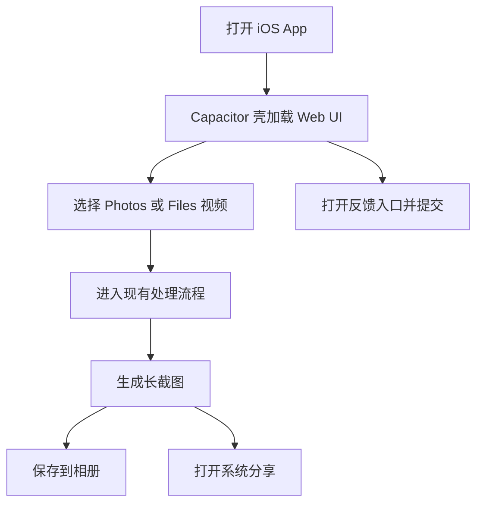

# iOS App Phase 1 Plan

## 摘要

- **功能目标**：启动 Picsew iOS App 第一阶段工作，交付一个可安装、可运行、可导入视频并保留反馈入口的 iOS App 基线版本。
- **核心决策**：第一阶段继续复用现有 Web UI，采用 `Capacitor + iOS 原生能力接入` 的路线，不做全量原生重写。
- **当前状态**：Capacitor iOS 壳已初始化，第一阶段计划已批准，可以按阶段实施。

---

## 术语定义

> <!-- TODO: 词汇表待建，暂不引用 -->

| 术语              | 定义                                                                        |
| ----------------- | --------------------------------------------------------------------------- |
| Phase 1           | iOS App 第一阶段，目标是完成可运行 App 壳、基础导入导出能力和反馈链路验证。 |
| App shell         | 由 Capacitor 承载现有 Web 前端并在 iOS 中运行的基础应用外壳。               |
| Native capability | 通过 Capacitor 或 iOS 插件接入的系统能力，例如相册选择、保存到相册和分享。  |

## 1. 需求背景

- **议题编号**: `ios-app-phase-1`
- **业务背景**: Picsew 已经有可用 Web 版本，也已经初始化了 Capacitor iOS 工程。为了给高频用户更便捷的入口，需要开始建设第一版 iOS App。
- **当前问题**:
  1. iOS 工程虽然存在，但还没有形成可执行的实施计划。
  2. 还没有明确第一阶段应该做哪些 P0 能力，以及哪些事情应该延后。
  3. 还没有定义 iOS 第一阶段的完成标准和验证方式。
- **目标**:
  1. 明确 iOS 第一阶段范围、优先级和分工顺序。
  2. 让第一阶段聚焦“可安装、可导入、可导出、可反馈”的最小闭环。
  3. 为下一步实现工作提供逐文件级别的实施入口。

### 范围外（Out of Scope）

- 不在第一阶段重写为 SwiftUI 原生界面。
- 不在第一阶段引入账号体系、登录或云同步。
- 不在第一阶段引入广告、订阅或其他商业化能力。
- 不在第一阶段把视频处理核心迁移到 Swift 原生实现。

### 验收标准

- [ ] AC-01：[P0] 本地能够打开并运行 iOS App 壳。
  - **Given**: 开发者已安装 Xcode，并在仓库中执行 `npm run cap:sync:ios`。
  - **When**: 开发者打开 iOS 工程并在模拟器或真机上运行。
  - **Then**: App 成功启动并显示 Picsew 主界面。
- [ ] AC-02：[P0] App 内能够从 Photos 或 Files 选择视频并回到现有处理流程。
  - **Given**: 用户已安装 App，并授予必要媒体访问权限。
  - **When**: 用户从相册或文件系统选择一个视频。
  - **Then**: App 获得视频文件并进入现有 Web 处理流。
- [ ] AC-03：[P0] App 内能够保存结果到相册，并支持系统分享。
  - **Given**: 用户已成功生成长截图。
  - **When**: 用户点击保存或分享。
  - **Then**: 图片可保存到 Photos，或通过系统分享面板发送到其他应用。
- [ ] AC-04：[P1] App 内反馈入口和 Web 保持一致，能够提交到现有反馈后端。
- [ ] AC-05：[P1] 第一阶段实现有明确的设备、权限和验证清单。

## 2. 用例

### 2.1 参与者

| 参与者              | 说明                                             |
| ------------------- | ------------------------------------------------ |
| iPhone 用户         | 安装 Picsew App 的终端用户。                     |
| Capacitor App shell | 承载现有 Web UI 的应用容器。                     |
| iOS 系统能力        | Photos、Files、Share Sheet、权限弹窗等系统接口。 |

### 2.2 用例描述

| 用例编号 | 用例名称 | 参与者      | 前置条件     | 主流程                     | 后置条件         |
| -------- | -------- | ----------- | ------------ | -------------------------- | ---------------- |
| UC-01    | 启动 App | iPhone 用户 | App 已安装   | 打开 App                   | 进入 Picsew 首页 |
| UC-02    | 选择视频 | iPhone 用户 | App 已启动   | 从 Photos / Files 选择视频 | 视频进入处理流   |
| UC-03    | 保存结果 | iPhone 用户 | 已生成结果图 | 点击保存到相册             | 图片写入 Photos  |
| UC-04    | 分享结果 | iPhone 用户 | 已生成结果图 | 点击分享                   | 打开系统分享面板 |
| UC-05    | 提交反馈 | iPhone 用户 | App 已启动   | 打开反馈入口并提交         | 反馈进入现有后端 |

### 2.3 路径覆盖

| 路径类型 | 场景描述               | 期望结果                       |
| -------- | ---------------------- | ------------------------------ |
| 正常路径 | 用户导入视频并完成处理 | 正常预览、保存、分享           |
| 边界路径 | 用户拒绝相册权限       | 给出明确提示和重试入口         |
| 异常路径 | 原生能力接入失败       | App 不崩溃，保留诊断和反馈入口 |

## 3. 设计

### 3.1 方案概述（ADR）

#### ADR-001: 第一阶段采用 Capacitor 复用现有 Web UI

**状态**：Accepted

**背景**：当前 Picsew 已有可用 Web 版本和初始化好的 Capacitor 工程。目标是尽快交付一个可安装的 iOS App，同时控制实现成本。

**决策**：第一阶段继续使用 Capacitor 承载现有 Web UI，只接入必要的 iOS 原生能力，不做 SwiftUI 全量重写。

**备选方案对比**：

| 方案                                           | 优点                     | 缺点                   | 结论 |
| ---------------------------------------------- | ------------------------ | ---------------------- | ---- |
| 方案 A：Capacitor + 现有 Web UI + 原生能力插件 | 复用高、交付快、适合 MVP | 原生交互精细度暂时有限 | 采用 |
| 方案 B：直接 SwiftUI 全量重写                  | 原生体验最好             | 开发成本高，启动慢     | 放弃 |

**后果**：

- 正面：可以快速得到第一版可安装 App。
- 负面/权衡：后续如果需要更深原生体验，仍需逐步替换高频交互。

#### ADR-002: 第一阶段只接入最小必要的原生能力

**状态**：Accepted

**背景**：第一阶段目标是形成基本闭环，而不是一次性完成所有 App 能力。

**决策**：只优先接入 Photos / Files 导入、保存到相册、系统分享和反馈验证，历史记录、原生设置页等能力后置。

**备选方案对比**：

| 方案                                         | 优点                               | 缺点                     | 结论 |
| -------------------------------------------- | ---------------------------------- | ------------------------ | ---- |
| 方案 A：只做 P0 原生能力                     | 实现聚焦，便于尽快验证真实使用场景 | 首版功能有限             | 采用 |
| 方案 B：首版就加入历史、设置、引导等完整能力 | 产品看起来更完整                   | 范围大，延长首版交付时间 | 放弃 |

**后果**：

- 正面：更容易尽快完成第一版验证。
- 负面/权衡：用户体验增强项需要在 Phase 2 继续补。

### 3.2 接口 / API 变更

无新增后端接口要求。第一阶段继续复用现有：

- 反馈提交接口：`VITE_FEEDBACK_ENDPOINT`
- 前端处理逻辑：现有 Web 前端处理流

原生能力接口将通过 Capacitor 插件或 iOS 工程能力接入。

### 3.3 数据模型变更

无强制数据模型变更。

可选后续项：

- 本地历史记录缓存
- 最近使用参数缓存

这些能力不属于 Phase 1 P0。

### 3.4 核心执行流程

### 3.5 关键实现要点

- 保持当前 `Capacitor + Web UI` 结构不变。
- 为 iOS 第一阶段准备统一的权限说明和验证清单。
- 优先评估官方/成熟 Capacitor 插件，避免第一阶段不必要的自定义原生插件开发。
- 反馈入口必须在 iOS WebView 内可用，并继续走现有 Supabase 反馈链路。

## 4. 测试设计

| 测试名称                               | 场景           | 输入                        | 期望输出                   | 优先级 | 关联 AC |
| -------------------------------------- | -------------- | --------------------------- | -------------------------- | ------ | ------- |
| `ios shell launches successfully`      | 启动 App       | 默认构建                    | App 成功显示主界面         | P0     | AC-01   |
| `ios video import reaches upload flow` | 选择视频       | Photos / Files 中的测试视频 | App 获得视频并回到现有流程 | P0     | AC-02   |
| `ios export can save and share`        | 保存和分享结果 | 已生成截图                  | 成功进入相册保存和分享面板 | P0     | AC-03   |
| `ios feedback flow submits remotely`   | App 内提交反馈 | 任意有效反馈内容            | 反馈成功进入后端           | P1     | AC-04   |

## 5. 性能影响分析

- 第一阶段不修改视频处理算法本身，因此对现有处理性能影响有限。
- 主要性能风险在 WebView 内处理大文件时的内存占用，需要通过真机验证持续观察。
- 原生能力接入本身性能成本较低，重点是权限与文件传输链路的稳定性。

## 6. 依赖与风险

- **依赖**：
  - Xcode / iOS Simulator
  - Capacitor iOS 工程
  - 现有 Web 构建产物
  - 反馈后端可用
- **安全考量**：
  - 需要正确配置相册/文件访问权限说明
  - 不在客户端暴露非公开后端密钥
- **回滚方案**：
  - 如原生能力接入影响稳定性，可先退回纯 App 壳运行模式，仅保留已有 Web 流程

## 7. 实现清单

> Phase 1：工程与运行基线

- [ ] 检查 `capacitor.config.ts`：确认 App ID、App 名称和 `webDir` 配置符合当前产品目标。
- [ ] 检查 `ios/App/App.xcodeproj/project.pbxproj`：确认 iOS 工程能正常打开、构建和运行。
- [ ] 更新 `docs/capacitor-ios-setup.md`：补充第一阶段目标和执行顺序。

> Phase 2：P0 原生能力接入

- [ ] 接入 Photos / Files 导入能力：让用户可以从系统媒体源选择视频。
- [ ] 接入保存到相册能力：支持结果图直接写入 Photos。
- [ ] 接入系统分享能力：支持将结果图发送到其他应用。

> Phase 3：验证与反馈闭环

- [ ] 验证 `src/components/FeedbackDialog.tsx` 在 iOS WebView 内可用。
- [ ] 增加 iOS 运行与验证清单文档：记录设备、系统版本、权限和回归检查项。
- [ ] 视需要增加最小的 iOS smoke 测试或手工验证 checklist。

## 8. 部署与运维

- 新增或确认的配置项：
  - iOS Bundle Identifier
  - iOS 权限说明文案
  - 与 Web 同步的前端环境变量
- 第一阶段部署顺序：
  1. 更新 Web 前端并同步 Capacitor 资源
  2. 在 Xcode 中构建和运行
  3. 验证导入、保存、分享、反馈链路

## 9. 变更历史

| 版本  | 日期       | 修改人        | 变更摘要                                        |
| ----- | ---------- | ------------- | ----------------------------------------------- |
| 0.1.0 | 2026-03-29 | Jayson Albert | 初版 iOS 第一阶段计划，明确目标、范围和实施清单 |
