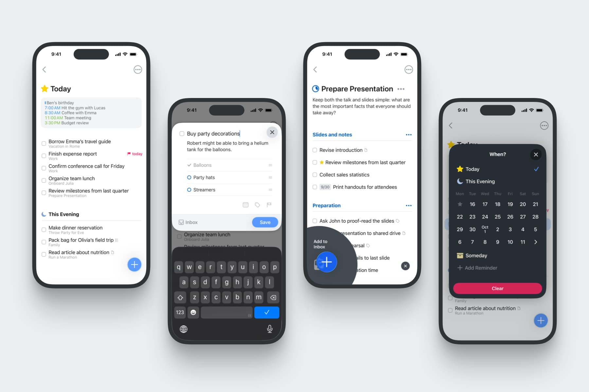
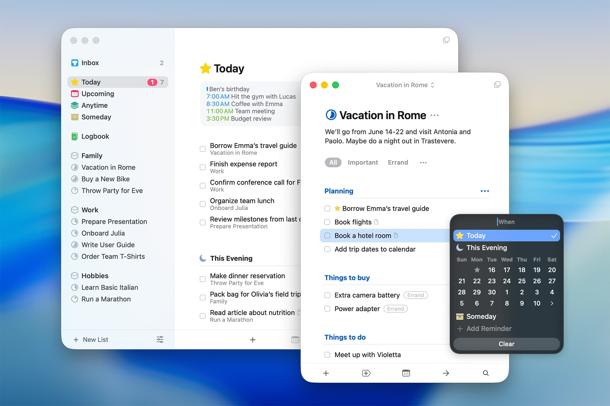
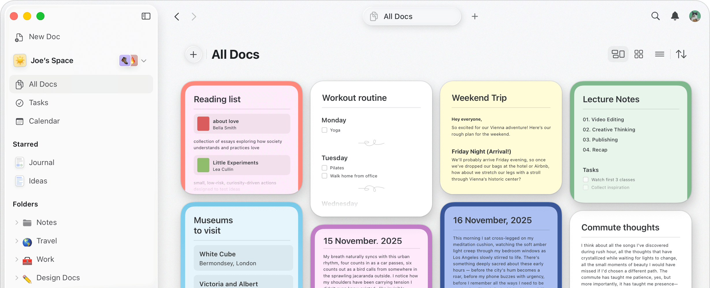
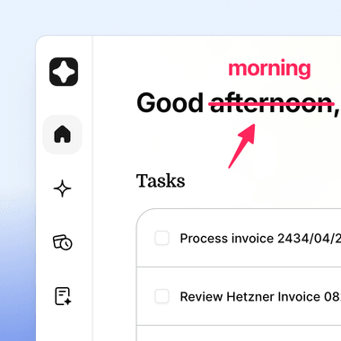

# Picsew 设计参考

采集日期：2026-10-01。以下为官方公开的产品界面素材，已逐张查看。
保留原始素材、来源和分析，作为 Web / iOS 设计讨论的参考；不放入生产页面。
截图与品牌版权属于各自产品，素材不是 Picsew 自有设计资源。

## 参考与取舍

| 产品        | 官方来源                                                                             | 从界面观察到的做法                                                                            | Picsew 的采用方式                                                                        |
| ----------- | ------------------------------------------------------------------------------------ | --------------------------------------------------------------------------------------------- | ---------------------------------------------------------------------------------------- |
| Things      | [OS 26 官方界面介绍](https://culturedcode.com/things/blog/2025/09/things-for-os-26/) | 明确的标题与正文层级；淡灰背景、白色内容；编辑面板底部的紧凑 Save；Mac 与手机采用不同布局密度 | 保持单标题、单内容舞台；桌面操作紧跟内容并右对齐，手机保持舒适的触控操作区               |
| Craft       | [官网产品界面](https://www.craft.do/)                                                | 清楚的内容分组；顶部工具轻量；内容卡片使用一致的圆角与内边距                                  | 让桌面内容列更宽一点；三屏使用相同宽度和间距节奏，不增加装饰性卡片                       |
| CleanShot X | [官网 Annotate 展示](https://cleanshot.com/)                                         | 图片是主体，工具与图片内容分区，标注颜色只承担强调作用                                        | 预览以图片为主，技术信息继续收在详情中；保留 Picsew 的青绿色主色，不引入多种竞争的强调色 |

上述是对具体截图的设计分析，并非这些厂商针对 Picsew 的建议。
不移植任务列表、侧边栏、文档网格或截图标注等不属于当前流程的功能。
Things 的系统玻璃效果、Craft 的多彩文档皮肤也不直接移植到 Picsew。

## 官方原图

### Things：iPhone

[原图](https://culturedcode.com/frozen/2025/09/things-os26-screenshot-ios-io75.jpg)

### Things：Mac

[原图](https://culturedcode.com/frozen/2025/09/things-os26-screenshot-macos-io75.jpg)

### Craft：桌面文档界面

[原图](https://www.craft.do/_image/width=3840,quality=85,format=auto/_next/static/media/hero-screenshot-desktop-full.4be7130c.png)

### CleanShot X：官网标注功能局部展示

这是官网的局部功能图，不是完整编辑器截图。

[原图](https://cleanshot.com/_ipx/f_png&q_90&s_380x380/img/home/annotate/markup.png)

## 本次落地及以后使用

[共享设计约定](../../docs/product-ui-guidelines.md)仍拥有跨端的颜色、层级和交互语义。
本次 [Web 桌面适配](../../docs/features/web-desktop-layout.md)采用内容驱动的高度、
40rem 桌面内容列、紧凑且右对齐的桌面创建/导出操作，以及更清楚的标题间距。
640px 以下手机布局继续保留底部操作区。

后续 iOS 设计调整也应从这些素材提取适合当前流程的做法，并用当前改动的三屏截图
与共享约定对照。参考图本身不证明实现的视觉质量；上线前必须检查实际界面。
